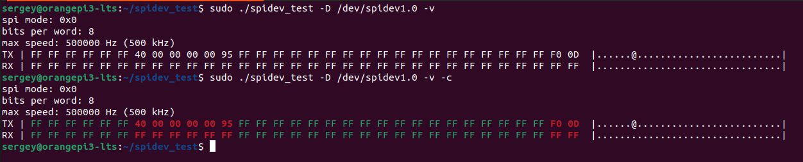

## SPIDEV_TEST

Программа для проверки работы spidev в linux. Оригинал - [spidev_test.c](https://github.com/torvalds/linux/blob/master/tools/spi/spidev_test.c). В этой версии добавлен ключ "-c" для отображения содержимого в цвете

Сборка:

```
cd ~
git clone https://github.com/Sergey1560/spidev_test.git
cd ./spidev_test
gcc spidev_test.c -o spidev_test
./spidev_test -h
```

Доступные параметры:

```
Usage: ./spidev_test [-DsbdlHOLC3vpNR24SI]
  -D --device   device to use (default /dev/spidev1.1)
  -s --speed    max speed (Hz)
  -d --delay    delay (usec)
  -b --bpw      bits per word
  -i --input    input data from a file (e.g. "test.bin")
  -o --output   output data to a file (e.g. "results.bin")
  -l --loop     loopback
  -H --cpha     clock phase
  -O --cpol     clock polarity
  -L --lsb      least significant bit first
  -C --cs-high  chip select active high
  -3 --3wire    SI/SO signals shared
  -v --verbose  Verbose (show tx buffer)
  -p            Send data (e.g. "1234\xde\xad")
  -N --no-cs    no chip select
  -R --ready    slave pulls low to pause
  -2 --dual     dual transfer
  -4 --quad     quad transfer
  -8 --octal    octal transfer
  -S --size     transfer size
  -I --iter     iterations
  -c --color    color
```

Пример проверки работы /dev/spidev1.0:

```
sudo ./spidev_test -D /dev/spidev1.0 -v
spi mode: 0x0
bits per word: 8
max speed: 500000 Hz (500 kHz)
TX | FF FF FF FF FF FF 40 00 00 00 00 95 FF FF FF FF FF FF FF FF FF FF FF FF FF FF FF FF FF FF F0 0D  |......@.........................|
RX | FF FF FF FF FF FF FF FF FF FF FF FF FF FF FF FF FF FF FF FF FF FF FF FF FF FF FF FF FF FF FF FF  |................................|
```

С параметром "-c" совпадающие значения отображаются зеленым, отличные - красным.




Проверка случайным набором данных:

```
sudo ./spidev_test -D /dev/spidev1.0 -v -c -S 32 -I 1
```
